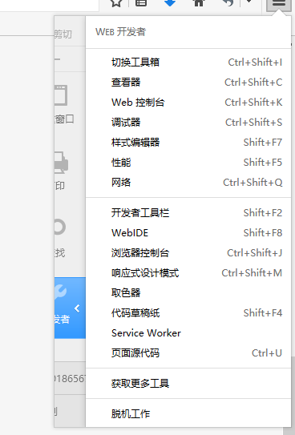
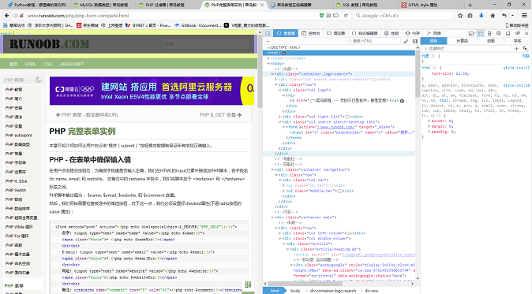
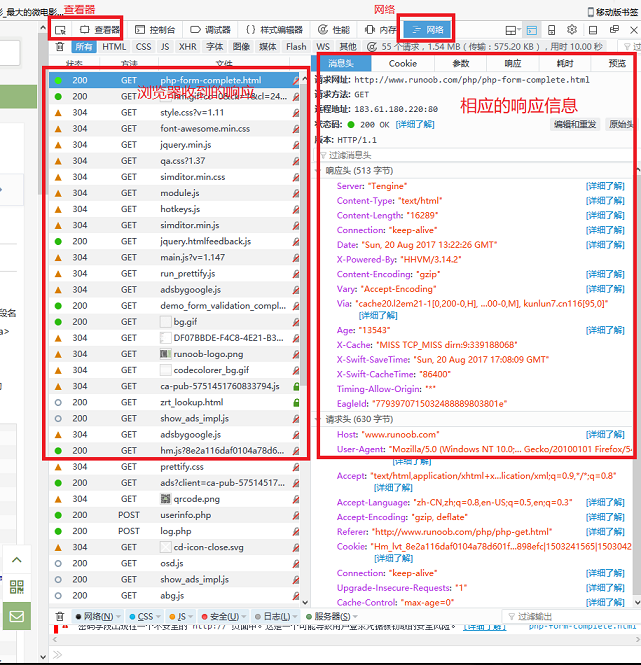
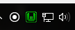
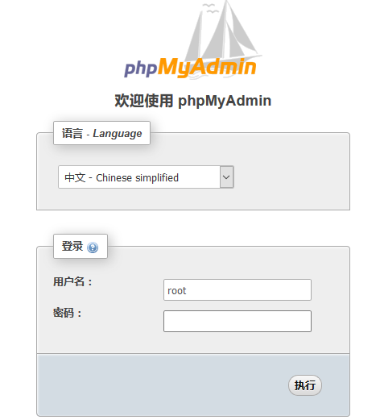

# 这里是计软义工 #

----

## 为什么要写这个？ ##

这是个好问题，因为`我也不知道`，可能是因为这作者比较无聊？  

## 这里会写些什么？ ##

就是你看的这些。  

OK，其实无非就是一下几点：  

- 关于计软义工的；  
- 关于这里的书库的；  
- 关于这个网站的开发；
- ；  

还有其他的吗，没有的。

## 关于计软义工的 ##

这里让会长写写好不好？

## 关于书库的 ##

让例行部长写吧。

## 关于这个网站的开发 ##

截至作者偷懒写这东西的时候，网站只有一个雏形，她是这样的：  
  

以后是怎么样的以后再说吧。  

这个网站在开发时主要用了一下工具：

> 1. WAMPServer 3.0.6 64bit  
> 2. NetBeans IDE 8.2  
> 3. Firefox 浏览器

其中`NetBeans`是用来开发写代码的；  
`firefox浏览器`是用来查看和调试的；  
`WAMP`是Windows、`apache`、`MySQL`和`PHP`的合称，`apache`是服务器模块，`MySQL`是数据库模块，`php`是服务器端运行的脚本。  

网站运作的过程基本就是浏览器和服务器的各种坑藏交易，这场交易是通过HTML/css、js、php等脚本语言来搞的。

下面将介绍关于关于网站开发的一些内容：  

- 开发环境的搭建；  
- 基本操作的尝试；  
- 复杂实现的总结；

好了就这些了。

### 开发环境的搭建 ###
**Firefox浏览器**  
为什么要用的Firefox浏览器呢，这可能是作者的特殊癖好吧。 
 
浏览器有个好用的功能，叫`开发者工具`,这是个神器，在网络编程中帮大忙了。因为用惯了Firefox的，所以这里就简单介绍一下它的`开发者工具`，其他浏览器例如`chrome`的也很强大，可以去试试看。  
如下图是火狐的开发者工具菜单：  
   

因为水品有限，只对查看器和网络这两个工具比较熟悉，试着点了`查看器`工具，结果如下：  
  
可以看到左边是原网页，右边是工具界面。试试看嘛，把鼠标放到原网页上可以看到工具把网页上的元素分析出来了，工具界面调出该元素的源代码等等的信息。这样就可以很快的分析网页的代码（并尝试找出其中的漏洞什么的了）。  

再试试`网络`工具，结果如下：  
  
这里涉及的东西比较多，所以就不深入。  

**NetBeans**  
为什么不用vs啊？咦好像可以试一试( •̀ ω •́ )y。  
据说PHP应该用文本编辑器写的，不过好像IDE会方便一点呢，据说NetBeans是免费中比较好用的一款，那就用了。  
结果还好，没有eclipse那烦人的配置，用着用着居然觉得挺好用的。  
新建项目的时候把项目路径放在WAMP的www文件夹里就可以了，好像忘了还有什么配置，就该就这些了。  

**WAMP**  
这个也方便，下载，安装。  
然后就可以启动了，启动结果再任务栏里，如下图：  
  
如图那个W，如果是绿色的就表示服务均启动成功，正常！  
如果运气不好就可能会橙色甚至红色，这表示有些服务未能成功启动，就要网上查资料找找原因了。  

上文讲到，WAMP是包括`apache`、`MySQL`、`PHP`的，所以就要分别对这三个进行配置了。  
先对`MySQL`，他是需要账户和密码的，管理员`root`是初始没有密码的，可以通过`phpMyAdmin`工具进行管理和设置。左键单击W图标可以看到`phpMyAdmin`的入口，点击结果如下图：  
  
如图密码留空直接点执行就可以登陆了。  
登陆后就可以添加密码和修改账户等等了。  
这里有数据库的图形化管理，很方便熟悉一下就可以上手了。 

哎写到这里不想写了，请移步[这里](http://blog.csdn.net/geofferysun/article/details/9046693)和[那里](http://www.cnblogs.com/airbreak/p/6369764.html)看看吧。  

   

### 基本操作的尝试 ###

### 复杂实现的总结 ###

## 关于这里的一些展望 ##

作者很赖，还没有展望。