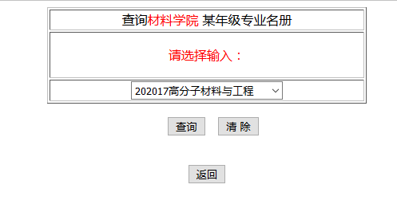
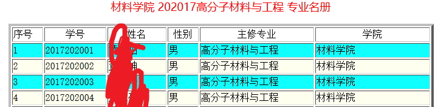
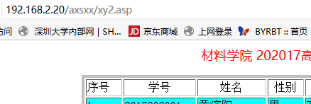
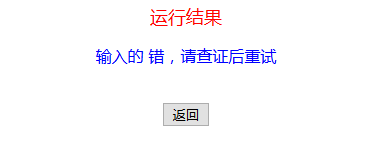
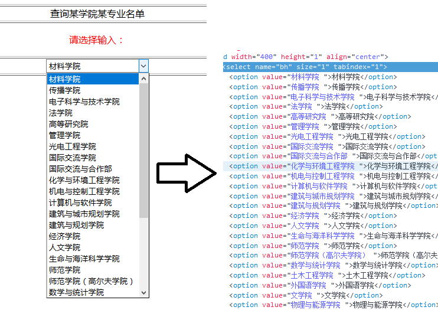
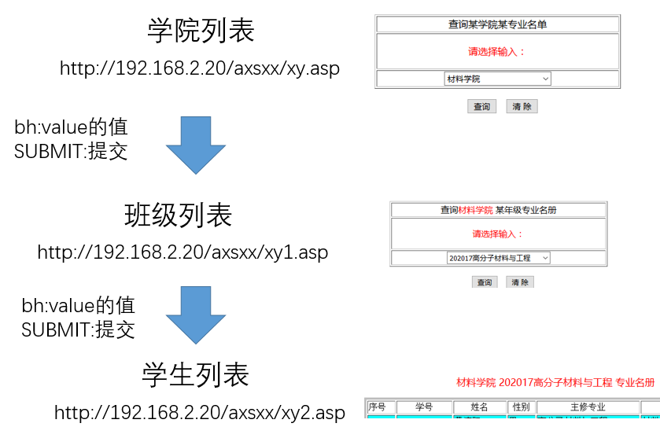

# 为什么知道我的学号和名字？ #
*张建葵 2017/8/22 14:52:21*
***
That's a good quetion.  
这都是在校内网里收集的。其细节将会如下表述：  

- 为什么需要知道你的学号和名字；  
- 怎么知道你的学号和名字；  
- 相关代码。  

总的来说，我们数据库里已经有了你的学号和名字。如果你嫌新建账户又要想密码太麻烦了，也可以用一个很简单的密码因为这里的用户并没有什么价值。不用担心你的隐私哦。  

## 为什么需要知道你的学号和名字？ ##

- 这是深圳大学的校内网站基本上只允许深圳大学在校生使用；  
- 单一学号只能注册单一账户应该可以防止重复注册；  
- 开发者手痒想试试手。  

## 怎么知道你的学号和名字的？ ##

在教务管理那里收集的。  
当然了，现在没能力访问教务管理的数据。所以这里是在教务管理网站上对外公开的表格里一个一个收集的，具体过程如下：  

在教务管理的学生信息那里有一个入口叫`在校生某专业学生名单`，如下图：  

  

进入后可以看到：  

  

and then`http://192.168.2.20/axsxx/xy1.asp`:  

  

then`http://192.168.2.20/axsxx/xy2.asp`:  

  

你们的信息就在这里啦。  

当然不会去手动复制粘贴这辈子都不可能复制粘贴的，太多了而且毫无技术含量。所以只好写个小爬虫来自动地复制粘贴。小爬虫的目标是进入到上图的表格页面然后把上面的名单复制下来，所以下面将介绍如何进入到这个表格页面：  

如下图可以看到表格页面的地址是：`http://192.168.2.20/axsxx/xy2.asp`:  
  

但是复制该网页进入会：  
  
原因是这个页面需要提交表单数据。  

这个表单数据可以在这个表格网页的上一级网页`http://192.168.2.20/axsxx/xy1.asp`看到:  
  
如上图，下拉框的每一项对应一个`value`，这个`value`就是需要向`http://192.168.2.20/axsxx/xy2.asp`提交的表单数据了，其实表单数据除了这个`value`还有一个`submit`，如下图：  
   
上图可以看到，表单数据有两项：  

> bh："202017%B8%DF%B7%D6%D7%D3%B2%C4%C1%CF%D3%EB%B9%A4%B3%CC"  
> SUBMIT:"%B2%E9%D1%AF"  

其中`bh`的值就是上上图中`value`的值，不是中文吗怎么变成一堆%号了？这是因为中文表单需要编码了才提交的。  
而`SUBMIT`的值`%B2%E9%D1%AF`其实就是中文`提交`。  

**所以这里就可以通过遍历`http://192.168.2.20/axsxx/xy1.asp`上的代码，对于每个`value`都生成一个表单值：**  

> bh：`value`的值  
> SUBMIT:`提交`  

**然后以`POST`的方式访问`http://192.168.2.20/axsxx/xy2.asp`，（同时还需要设置好cookie），这样就可以正确的向它提交表单，然后给你返回一个对应的表格页面。**  

然后问题就是怎么进入`http://192.168.2.20/axsxx/xy1.asp`了。  

如果直接从浏览器上访问`http://192.168.2.20/axsxx/xy1.asp`，会这样：  
  
原因跟`http://192.168.2.20/axsxx/xy2.asp`的一样哦，显示的*202017高分子材料与工程*其实是上文同应该向`http://192.168.2.20/axsxx/xy2.asp`提交的表单`value`，浏览器会保留当前的表单信息直到被修改，下面将介绍如何发现、设置访问`http://192.168.2.20/axsxx/xy1.asp`的表单：  

其实`http://192.168.2.20/axsxx/xy1.asp`的上一级页面是`http://192.168.2.20/axsxx/xy.asp`，不告诉你是怎么发现的。  

同上文的很相似，`http://192.168.2.20/axsxx/xy.asp`的代码精华如下图：  
   
这个其实是和上文一样的，我都不想再讲了。  

同样的方法找到表单的值并设置表单然后正确访问`http://192.168.2.20/axsxx/xy1.asp`了。  

### 总结 ###

其结构就是如下：  
   

1. 遍历学院列表，获取每个`value`的值并由此向班级列表提交表单，由此获得每个学院的班级；  
2. 遍历某学院的班级列表，获取每个`value`的值并由此向学生列表提交表单，由此获得每个班级的学生列表；  
3. 遍历某班级的学生列表，并复制粘贴。  

## 相关代码 ##

用Java实现的。不给你看。  

